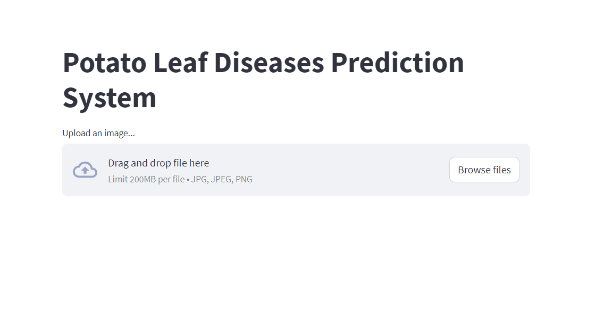

# Potato_leaf_diseases_prediction

Potato Leaf Diseases Prediction is a web app build using streamlit which can be which to check whether the potato's leaf are healthy or suffer from early blight or late blight.

Different agricultural country's farmer are worried about their crops and failed to identify whether their popato's are better or not. In order to identify those problems, this web app can help them to identify the quality of the potatoes by checking their leafs.Farmers can upload potato's leaf and can identify whether the potatos are healthy or not.

The interaface of the app looks like the following with sample test of an images



## Installation

Clone the repository and navigate to the folder

```bash
  git clone https://github.com/dipakadk/potato_leaf_diseases_prediction.git
```
Use the package manager pip to install the required packages and libraries.
 ```
   pip install -r requirements.txt
 ````
## How to run the project?
You can run the app by using the following command
```
streamlit run app.py

```
## 🔗 Contact me 

[](https://www.linkedin.com/in/dipak-adhikari-3ba571212/)
[](https://twitter.com/adhikary9844)


## License

[MIT](https://choosealicense.com/licenses/mit/)

